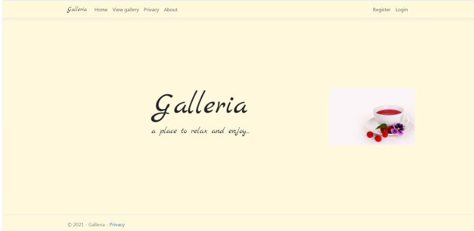

# Galleria

> This project was made for educational purposes and as a reference on job interviews. 

Galleria is a web application made for amateur photographers who would like to publish their work online.
Besides uploading images, there is also a posibility of reviewing them.

## Built With

- ASP.NET Core C#

